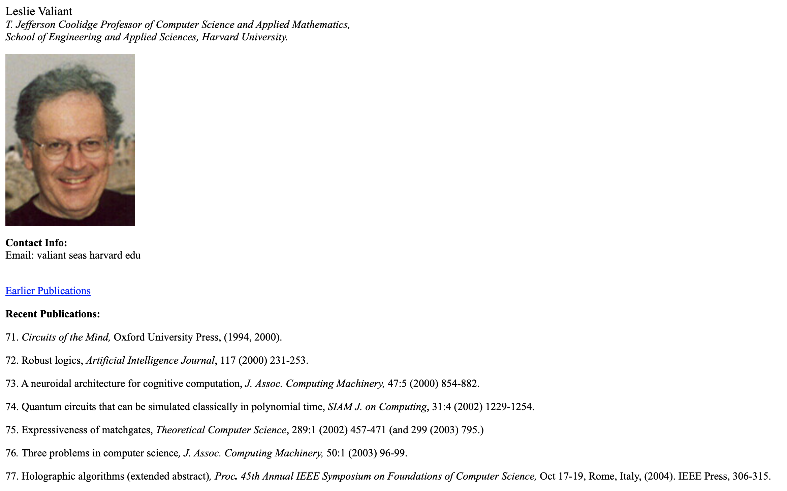

# Project: CS Professor Home Page

## Introduction

Computer Science professors are notorious for having plain-looking HTML websites that are unstyled, or styled poorly. 

Here’s a sample of websites from Harvard’s CS department:

- http://www.eecs.harvard.edu/~dbrooks/
- https://www.read.seas.harvard.edu/~kohler/
- http://www.eecs.harvard.edu/~michaelm/
- http://madhu.seas.harvard.edu/
- http://people.seas.harvard.edu/~valiant/

Here's a screenshot of a typical website, in case you don't want to browse to those pages:

After this week's lessons, you know all the HTML you need to  make your own website as good as these best-in-the-world professors! You'll practice using the basic elements you've learned, be creative, and work together.

## Your Task

For this project, you’re going to build your own website, "CS Professor" style. Of course, you aren’t actually a CS professor! You’ll have to be inventive and make up:

* your institution
* your position on the faculty
* your recent publications
* the courses you’ve taught
* Phd students you’ve supervised

### Disclaimer

Since it's a fake page, we've added a disclaimer to the top of the page letting folks know that it's not real. **Leave the disclaimer and its styles alone at the top of the page**, so that no one thinks we're trying to fool them.

## Instructions

**Before you get started**

Prepare what you'll need to build the site. Write down all of the facts and info you'll put on the website. You can use the file `site-plan.md` to take notes, or write things somewhere else.

You'll need:
* An old, fuzzy, or silly photo of you
* The name of the fake institution where you're a fake professor
* Contact info, but with your email address written out like "name AT institution DOT edu"
* A list of fake publications
* A fake bio or background
* Links to other pages

**Working together**

If you're working in a team, work together to come up with the facts and info. Decide which of your names you'll use (or make up a persona with a fake name to use instead). 

Working in a team, it's even more important to write down your notes as you come up with ideas and work on the site. Use `site-plan.md` or message each other in chat to stay on the same page.

**Building the site**

Once you have all the materials, you should start building the site in HTML. Decide on the appropriate HTML elements for each of the pieces of information you're adding to the site. Lists should use list elements, emphasized text should use emphasis elements, and paragraphs should use paragraph elements!

After you've added all the Elements to your site, check that the style is similar to the CS Professor sites linked. If you want, you can add some additional styles to `styles.css`, but it's okay if you don't style the page any further.

Check your work against the rubric below, and then click Submit!

## Rubric

Use this checklist to confirm that you've included everything you need:

- [ ] Uses at least 2 heading elements (like h1 or h4)
- [ ] Uses at least one paragraph element
- [ ] Uses an image element
- [ ] Uses the list and list item elements
- [ ] Includes links to other pages
- [ ] Still has the Disclaimer at the top of the page
- [ ] Shows your creativity

## Bonus: Other ideas

If you have submitted the project and you have more time, you can be creative and add more things to your page. Here are just a few ideas:

* Create a fake CV or bio as a pdf
* Link to some other faculty pages, or to an institution's home page
* Add ResearchGate or social media links
